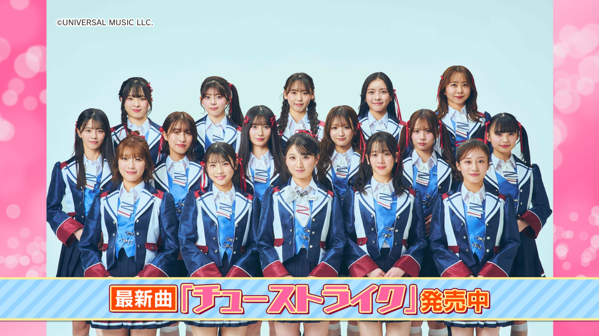
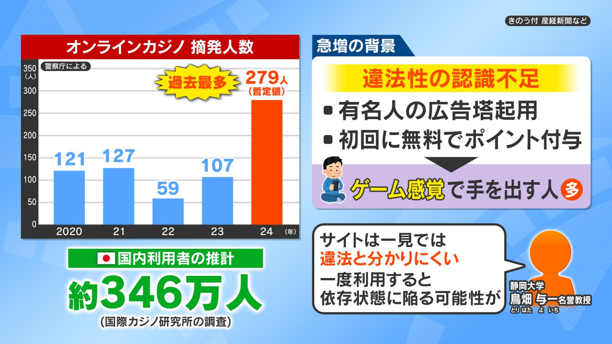
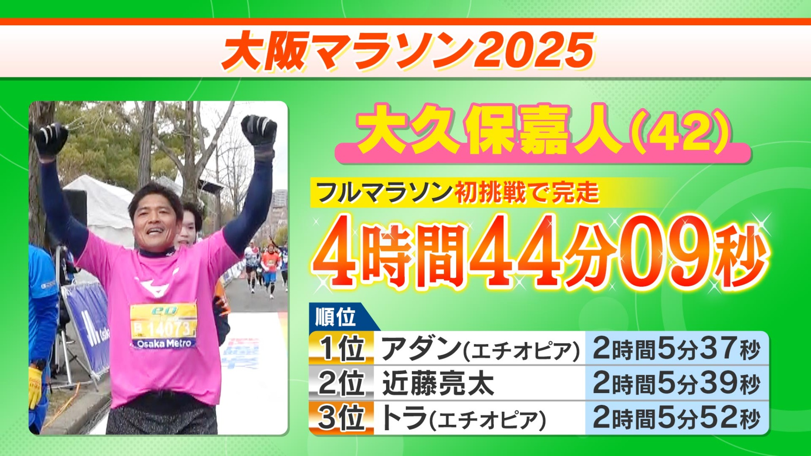
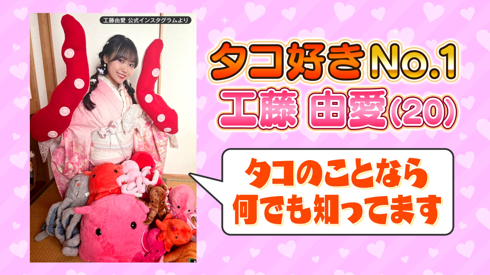

<!DOCTYPE html>
<html lang="ja">

<head>
  <meta charset="UTF-8">
  <meta name="viewport" content="width=device-width, initial-scale=1.0">
  <title>泰嗣 -Taishi- | Video & Graphic Portfolio</title>

  <!-- Google Fonts -->
  <link
    href="https://fonts.googleapis.com/css2?family=Montserrat:wght@700;900&family=Noto+Sans+JP:wght@300;500;700&display=swap"
    rel="stylesheet">
  

  
</head>

<body>

  <!-- Navigation -->
  <nav class="fixed top-0 w-full z-50 px-8 py-6 flex justify-between items-center mix-blend-difference">
    
Taishi

    

      <a href="#work" class="hover:text-gray-400 transition">Work</a>
      <a href="#service" class="hover:text-gray-400 transition">Service</a>
    

  </nav>

  <!-- Hero Section -->
  <header class="h-[80vh] flex flex-col justify-center px-8 md:px-20 border-b border-zinc-900">
    <h1 class="hero-title font-black uppercase reveal">Video & Graphic</h1>
    
Production Portfolio 2026

  </header>

  <!-- Work -->
  <section id="work" class="py-32 px-8 md:px-20 bg-zinc-950">
    

      

        <h2 class="text-xs tracking-[0.5em] text-zinc-500 uppercase mb-4 font-bold">Portfolio</h2>
        <h3 class="text-5xl font-black tracking-tighter">SELECTED WORKS</h3>
      

      

        Web Design, TV Graphics & Video Production
      

    

    <!-- Webサイト制作 セクション -->
    

      

        <h4 class="text-2xl font-bold border-l-4 border-white pl-4 tracking-wider">Webサイト制作</h4>
        

          Swipe
          <svg class="w-3 h-3 text-white animate-swipe-indicator" fill="none" stroke="currentColor" viewBox="0 0 24 24">
            <path stroke-linecap="round" stroke-linejoin="round" stroke-width="2" d="M14 5l7 7m0 0l-7 7m7-7H3"></path>
          </svg>
        

      

      

        <!-- Work Card 1 -->
        <a href="https://nekotomo22.github.io/rikitokuakira_officialsite/" target="_blank" rel="noopener noreferrer"
          class="work-card block relative aspect-video overflow-hidden bg-zinc-900 reveal group flex-none w-[80vw] md:w-auto snap-center">
          
          

            Web Site
            <h3 class="text-xl font-bold">力徳明 オフィシャルサイト</h3>
          

        </a>

        <!-- Work Card 2 -->
        <a href="https://nekotomo22.github.io/asoorganiccafe/" target="_blank" rel="noopener noreferrer"
          class="work-card block relative aspect-video overflow-hidden bg-zinc-900 reveal group flex-none w-[80vw] md:w-auto snap-center">
          
          

            Web Site
            <h3 class="text-xl font-bold">ASO ORGANIC CAFE</h3>
          

        </a>
      

    

    <!-- グラフィックデザイン セクション -->
    

      

        <h4 class="text-2xl font-bold border-l-4 border-white pl-4 tracking-wider">グラフィックデザイン</h4>
        

          Swipe
          <svg class="w-3 h-3 text-white animate-swipe-indicator" fill="none" stroke="currentColor" viewBox="0 0 24 24">
            <path stroke-linecap="round" stroke-linejoin="round" stroke-width="2" d="M14 5l7 7m0 0l-7 7m7-7H3"></path>
          </svg>
        

      

      

        <!-- Graphic Card 1 -->
        

          
          

            TV Graphic
            <h3 class="text-xl font-bold">エンタメ特集ビジュアル</h3>
          

        

        <!-- Graphic Card 2 -->
        

          
          

            TV Graphic
            <h3 class="text-xl font-bold">エンタメ特集ビジュアル</h3>
          

        

        <!-- Graphic Card 3 -->
        

          
          

            Information
            <h3 class="text-xl font-bold">データ解説・報道グラフ</h3>
          

        

        <!-- Graphic Card 4 -->
        

          
          

            News
            <h3 class="text-xl font-bold">エンタメ特集ビジュアル</h3>
          

        

        <!-- Graphic Card 5 -->
        

          
          

            Sports
            <h3 class="text-xl font-bold">スポーツグラフィック</h3>
          

        

        <!-- Graphic Card 6 -->
        

          
          

            Entertainment
            <h3 class="text-xl font-bold">エンタメ特集ビジュアル</h3>
          

        

      

    

    <!-- 動画制作 セクション -->
    

      

        <h4 class="text-2xl font-bold border-l-4 border-white pl-4 tracking-wider">動画制作</h4>
      

      

        

          <iframe class="w-full h-full absolute inset-0"
            src="https://www.youtube.com/embed/BE1S05eVIYU?si=qK-iiBn6_9GyEjIz" title="YouTube video player"
            frameborder="0"
            allow="accelerometer; autoplay; clipboard-write; encrypted-media; gyroscope; picture-in-picture; web-share"
            referrerpolicy="strict-origin-when-cross-origin" allowfullscreen>
          </iframe>
        

      

    

  </section>

  <!-- Service & Skills -->
  <section id="service" class="py-32 px-8 md:px-20 bg-zinc-950/50">
    

      

        <h2 class="text-xs tracking-[0.5em] text-zinc-500 uppercase mb-4 font-bold">Expertise</h2>
        <h3 class="text-5xl font-black tracking-tighter">SERVICE</h3>
      

      

        

          01
          動画編集
        

        

          02
          アー写撮影
        

        

          03
          MV撮影
        

        

          04
          PR動画制作
        

        

          05
          AIツール活用
        

        

          06
          WEBサイト制作
        

        

          07
          企画・提案
        

        

          08
          フライヤー制作
        

        

          09
          ショートドラマ制作
        

      

      <!-- Tools -->
      

        <h2 class="text-xs tracking-[0.5em] text-zinc-500 uppercase mb-8 font-bold">Tools</h2>
        

          Photoshop
          Illustrator
          Premiere Pro
          DaVinci Resolve
          CapCut
        

      

    

  </section>

  <!-- Footer (Simplified) -->
  <footer class="py-20 px-8 md:px-20 border-t border-zinc-900 text-center">
    

      &copy; 2026 TAISHI. ALL RIGHTS RESERVED.
    

  </footer>

  

</body>

</html>
